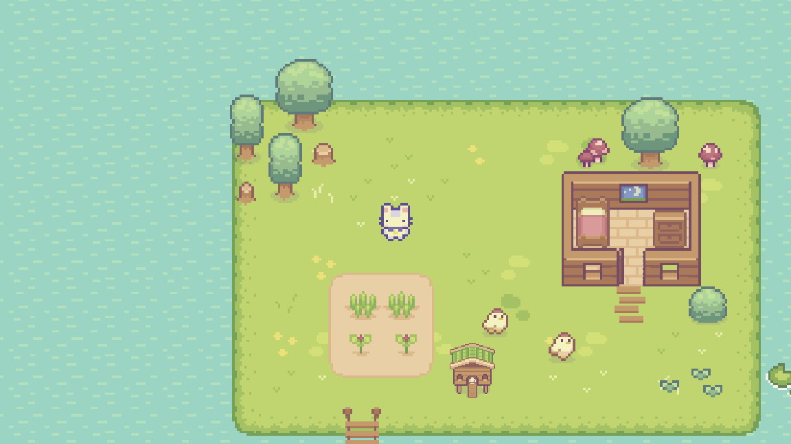
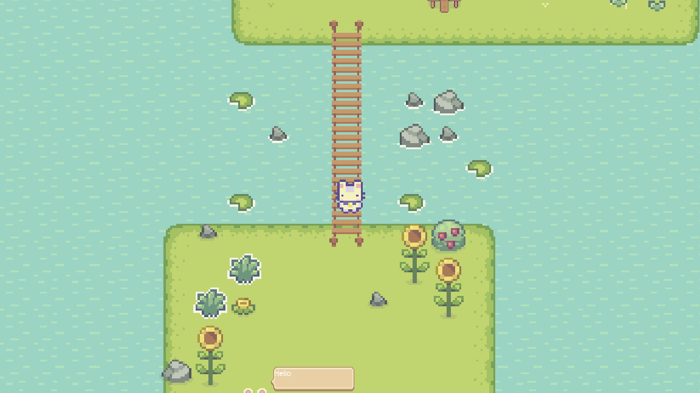

# Cozy-Farm

A small game made in Godot 4.

## Table of Usage

### Running the game
Download respective package from the relaease 

If any error pops up, run the "Run if error" file

### Working on it
Clone the repo and load in Godot 4.

Assets used from [Cup Noodles](https://cupnooble.itch.io/)

Submit bug reports and feature suggestions

## ScreenShots

